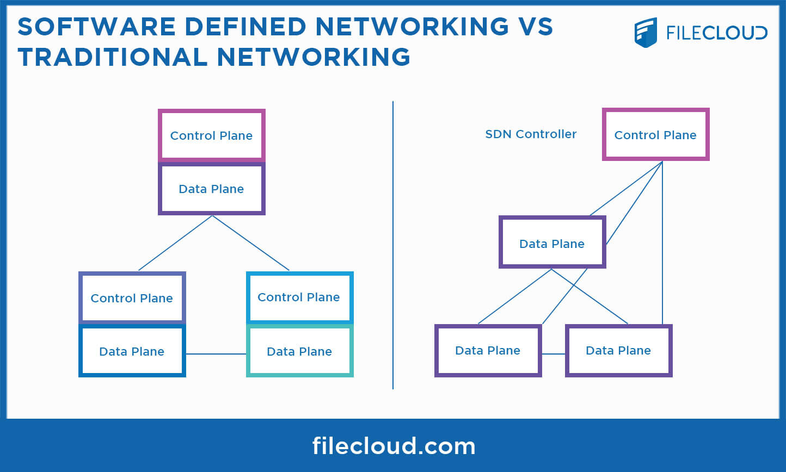
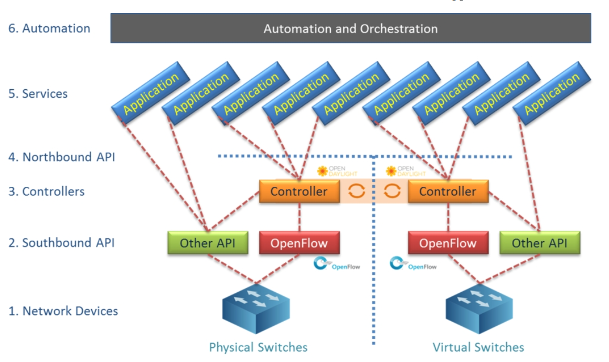
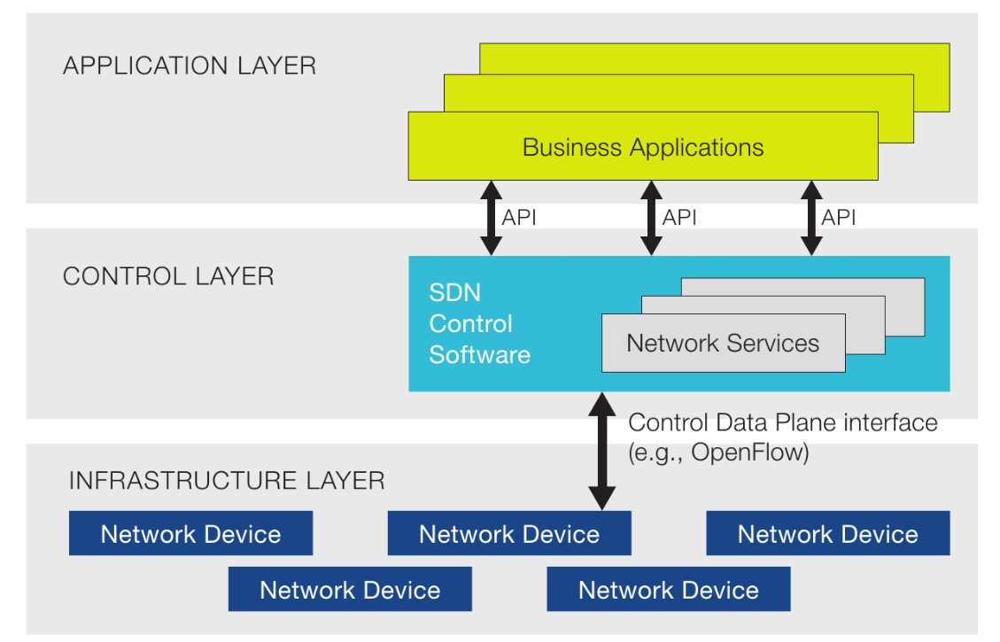
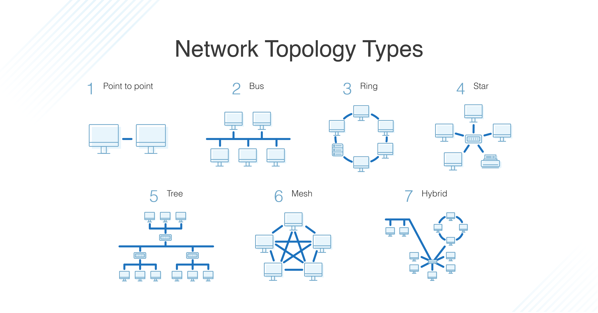

# Xây dựng một mạng SDN đơn giản với Ryu controller và Containernet

## SDN network

- Mạng SDN là kiến trúc mạng hiện đại và tiên tiến có khả năng tách biệt hoàn toàn giữa các phần mềm điều khiển (control plane) và phần cứng chuyển tiếp dữ liệu (data plane)

- Trong truyền thống, điều khiển và chuyển tiếp dữ liệu được tích hợp chặt chẽ trong các thiết bị mạng như switch và router. Điều này làm cho việc quản lý và điều khiển mạng phức tạp, đòi hỏi sự tương tác trực tiếp với từng thiết bị. Mạng SDN thay đổi cách tiếp cận này bằng cách tách biệt hai phần này.
  - Control Plane (Phần mềm điều khiển): Là trung tâm quản lý và quyết định cho toàn bộ mạng. Nó bao gồm các ứng dụng và phần mềm điều khiển, chịu trách nhiệm quản lý và theo dõi toàn bộ mạng. Phần mềm điều khiển tạo ra các chính sách (policy) và quyết định cách dữ liệu mạng phải được chuyển tiếp thông qua các thiết bị mạng.
  - Data Plane (Phần cứng chuyển tiếp dữ liệu): Là nơi thực hiện chuyển tiếp dữ liệu theo hướng dẫn từ phần mềm điều khiển. Phần cứng này có thể là các switch, router hoặc các thiết bị mạng khác. Chúng chỉ thực hiện việc chuyển tiếp dữ liệu mà không tham gia vào việc quyết định về cách xử lý dữ liệu.

- Giao thức OpenFlow: cho phép các ứng dụng trong phần mềm điều khiển gửi các yêu cầu và chỉ thị trực tiếp xuống phần cứng của chuyển tiếp dữ liệu

- Các lợi ích của mạng SDN:
  - Quản lý mạng nhanh chóng và linh hoạt hơn
  - Tích hợp dễ dàng với các ứng dụng và dịch vụ mạng
  - Tăng tính tin cậy và bảo mật của mạng
  - Tối ưu hóa việc sử dụng tài nguyên mạng

- Kiến trúc của SDN gồm 3 thành phần:
  - `SDN Networking Devices / Network Infrastructure`: Kiểm soát khả năng chuyển tiếp và xử lý dữ liệu cho mạng
  - `SDN Controller`: 
      - Nhận các hướng dẫn và yêu cầu từ tầng SDN Application và chuyển tiếp chúng đến các thành phần trong mạng.
      - Trích xuất thông tin về mạng từ các thiết bị phần cứng và liên lạc trở lại ứng dụng SDN với các số liệu thống kê và những gì đang xảy ra trong mạng
      - RYU, OpenDayLight, ONOS, FloodLight,..
    
  - `SDN Applications`: Là chương trình giao tiếp các hành vi và tài nguyên cần thiết thông qua APIs. Những ứng dụng này bao gồm quản lý mạng , phân tích, nghiên cứu,..
  
    

- Tham khảo thêm:
  - https://www.geeksforgeeks.org/software-defined-networking/
  - https://vietnix.vn/sdn-la-gi/
  - Udemy: Learn ​SDN, Mininet, Openflow, RYU Controller, Advanced Concepts( Master/Slave, Group table, Meter Table) Exercises - KNet Solutions

## Mininet

- Mininet có một công cụ mã nguồn mở với khả năng triển khai mô phỏng môi trường mạng ảo một cách nhanh chóng và dễ dàng. Được sử dụng phổ biến để mô phỏng các tình huống mạng phức tạp, kiểm tra giao thức mạng và phát triển ứng dụng SDN. Mininet có thể tạo mạng ảo trên một hoặc nhiều máy tính. Các tính năng của mininet:
  - Tạo ra mô hình mạng với các switch, host, link ảo
  - Topology mạng: Định nghĩa các kiến trúc mạng khác nhau như linear, tree, start (xác định cách các switch và hsot được kết nối với nhau)
    
    
  - Có thể thiết lập thông số như băng thông, độ trễ,...
  - Hỗ trợ các bộ controller khác nhau như Ryu, OpenDaylight, Floodlight (Có khả năng điều khiển và kiểm soát các switch mạng ảo)
  - Python API: có thể dùng python để lập trình sửa đổi và quản lý các kiến trúc mạng
  
- Ví dụ: `sudo mn --controller=remote,ip=127.0.0.1 --mac -i 10.1.1.0/24 --switch=ovsk,protocols=OpenFlow13 --topo=single,4`
  - Câu lệnh trên tạo ra một kiến trúc mạng với 4 switch theo topology linear, dùng giao thức OpenFlow13, switch ảo Open vSwitch

## Ryu controller 

- Ryu là một dự án mã nguồn mở cung cấp một framework cho việc phát triển các ứng dụng điều khiển mạng dựa trên giao thức OpenFlow. RYU cho phép bạn xây dựng các ứng dụng điều khiển mạng tùy chỉnh và linh hoạt, cho phép bạn tùy chỉnh hành vi của mạng theo cách bạn mong muốn.

- Triển khai Ryu với Flow manager: `ryu-manager --observe-links flowmanager.py ryu.app.simple_switch_13`

